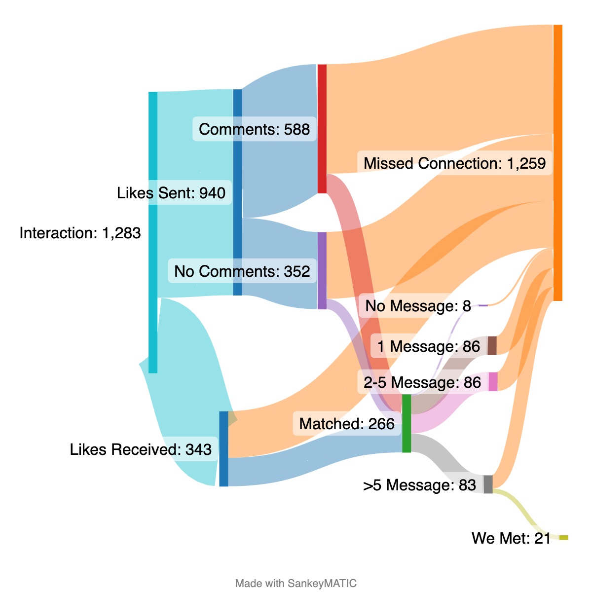
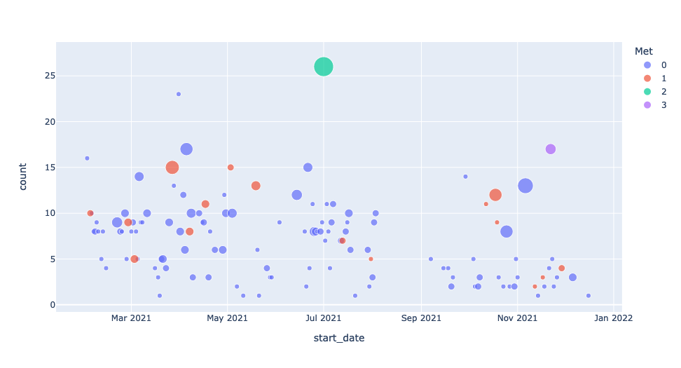
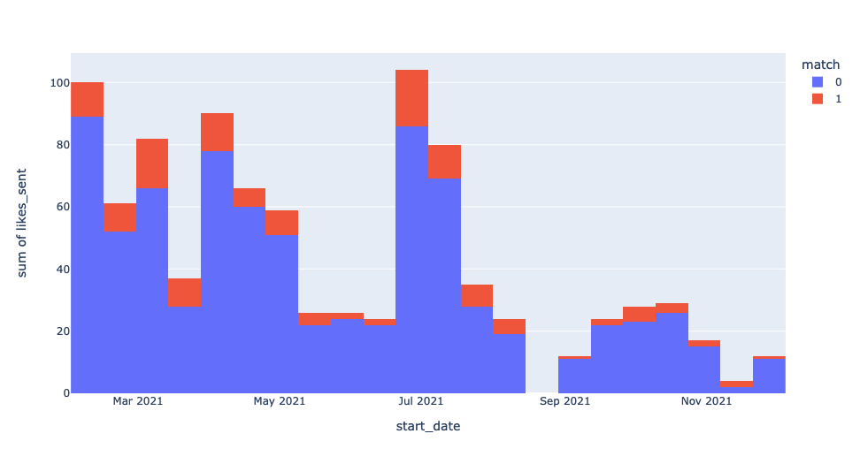
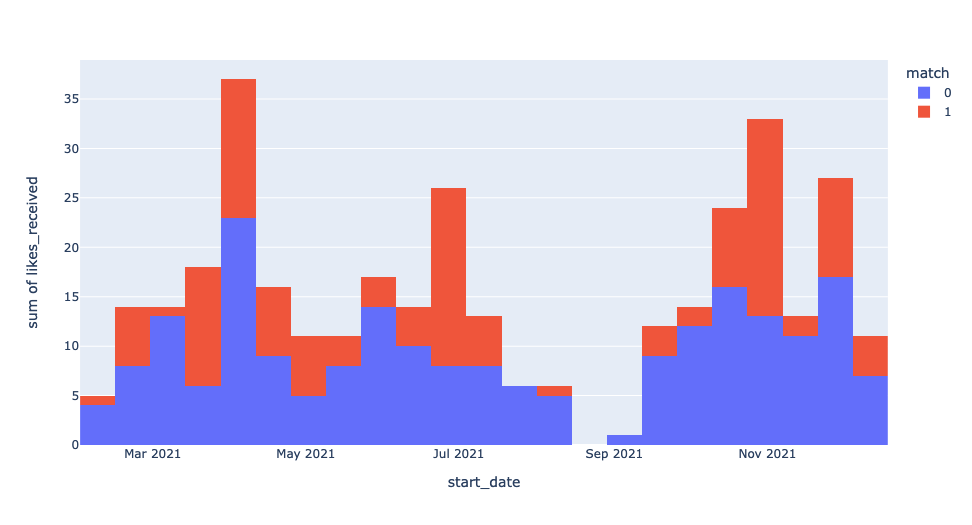

# Hinged Data Analysis

Keywords: Python | json | Pandas | Plotly | Data Visualization | Sankey Plot

## Outline 

- The goal of this project is to analyze the data from hinge dating app. 
- The app provides a dataset of json file (named `matches.json`) when the data is requested. 
  - The `cleaned_matches.json` is a file that is cleaned of any personal information where the messages are replaced with `Blah`*.
- The python notebook labelled `json_Unhinged.ipynb` is used to look at the data and also clean the json file so please refer to that for detailed steps. 
- This document outliens the highlights and insights of starting and using the Hinge app, in the DMV area from March 2021 to December 2021 (10 months)  

## Data Analysis

### Initial Challenges:
- We have a json file. It is more unique as teh format is nested dictionary and lists. So simply importing the json file to panda does not work.
- Secondly, the data set is per entry type so we need to parse it accordingly before we even attempt to analyze it.
  

### Sankey Plot of interaction.

This is an interesting plot. 
- We have a total of 1283 interactions.     
- Likes sent 940 (~73%) and Likes received 343 ~(27%). 
- With these, 266 were matches (~20%). 
- However, Even after matched, you might loose interest or the conversation doesnt go along well. So We can further divide it into 1 message, 2-5 messages or more than 5 messages. 
- There were a total of 83 interaction (~6%) of more than 5 messages
- Out of which I went out on 21 dates (1.5%).
- Note: This is the data for 10 months (March 21 to Dec 21) in the DMV area and was my first iteration of dating apps which was a learning experience.

### Interaction

Here, the size of the icon is no. of matches. The y axis is the interaction. We have grouped the data by starting date of the conversation.  The color is defiend by if the match from that date ended up meeting. This is a plotly plot snapshot. If ran in the notebook, the plot is interactive.

We can see that mostly its numbers game. There is the purple exception where the number of matches are less and met with 3 people. It is also interesting to see if in the next iteration i have a smaller size but more meeting as it would suggest i have learned to optimize it better like the purple. But clearly, June was the bussiest of matches. 

### Histogram by weekly
These are all weekly histograms

#### Likes Sent:
These are collected in terms of likes sent.     
- Y axis is likes sent, and the color is defined by matches.
- The number of likes sent and matches are cyclic and with few exceptions, there seem to be correlation of more matches with likes sent with more people met.
- It also shows the cyclic nature of meeting people, busier month, eventful months, taking breaks, burnt out, etc.
- It showcases that some time was taken to destress and reflect and then started using it more consiously.
- In reality, meeting and talking to more than 2 people in a week is already tiring.

#### Likes Received:       
- Y axis is likes received and red is the matched ones.
- This has been more realistic and almost steadier. 
- Clearly, the matches were more consistent after the break. 
- More priority was also given to likes received as we can compare this with the previous plot.
- If the likes are received, most probably we ended up meeting.

#### Simple Matches and met:  

- Y axis is no. of matches and color shows if we met.
- So this is more interesting plot which is the most important statistics.
- This defines how many matches and how many dates happened.
- Before the break, with a lot of matches came almost the same amount of dates.
- After the break, either there were no dates for the matches number or there were more dates/matches as compared to before the break.

## Conclusion

All in all it was fun to look at the year long data. Improvement depends on what metric to look at. If the total no. of dates is the concern then definitely its lower. But if the metric is to meeting/matches ratio then it is clearly improved. The next batch of data would be even more fun to look at.
